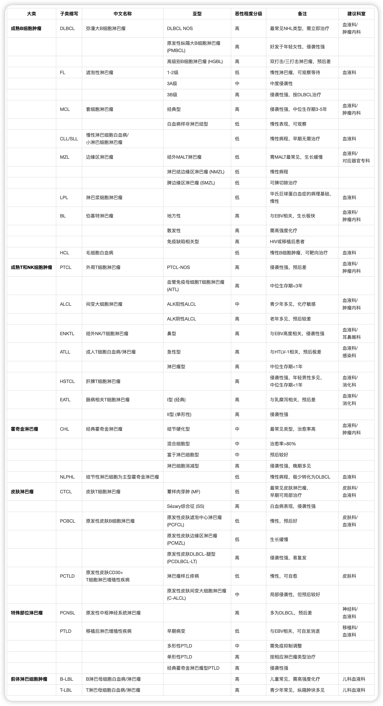

# 🔔 Little Bell: AI-Powered Lymphoma Patient Assistant

**X-Tumor-Pal Community x Shanxi Bethune Hospital Oncology Department x Fudan Cancer Hospital Lymphoma Department Collaborative Project**

> 📋 **Important Notice**: Please read the [**Community Guidelines**](./community_guidelines.md) before use 📋  
> Learn about data security, privacy protection, medical risk warnings and other important information

Little Bell is the first AI lymphoma assistant led by doctors and supported by the community, dedicated to providing professional and reliable medical knowledge services for lymphoma patients and their families.

## 🚀 Project Overview

Little Bell builds a knowledge base based on authoritative medical guidelines and uses advanced RAG (Retrieval-Augmented Generation) technology to provide 24/7 intelligent consultation services for lymphoma patients. Our goal is to bridge the information gap between doctors and patients, helping patients better understand their condition, treatment plans, and precautions, thereby improving treatment compliance.

### 📊 Project Statistics
- **Guidelines**: 20+ authoritative medical guidelines
- **Drug Information**: 15+ drugs collected, targeting 65 drugs
- **Classification System**: Complete WHO lymphoma classification standards
- **Bilingual Support**: 200+ professional terminology translation table

### ✨ Core Features
- 🏥 **Doctor-Led**: Guided by oncology experts from Shanxi Bethune Hospital
- 📚 **Authoritative Knowledge Base**: Based on NCCN, CSCO and other authoritative guidelines
- 🤖 **Intelligent Q&A**: Supports professional lymphoma-related consultations
- 🔒 **Safe & Reliable**: Strictly follows medical ethics, does not replace doctor diagnosis
- 🛡️ **Privacy Protection**: Zero active data collection, anonymous access, see [Community Guidelines](./community_guidelines.md)

## 📋 Knowledge Base Content

### Authoritative Guidelines Coverage
- **2023 CSCO Lymphoma Diagnosis and Treatment Guidelines**
- **NCCN 2025 Various Lymphoma Guidelines**:
  - Diffuse Large B-Cell Lymphoma Patient Handbook
  - Hodgkin Lymphoma Treatment Guidelines (Adult & Pediatric)
  - T-Cell Lymphoma Treatment Guidelines
  - Chronic Lymphocytic Leukemia/Small Lymphocytic Lymphoma Guidelines
  - Follicular Lymphoma Guidelines
  - Mantle Cell Lymphoma Guidelines
  - Marginal Zone Lymphoma Guidelines
  - Primary Cutaneous Lymphoma Guidelines
  - Cutaneous T-Cell Lymphoma Guidelines

### Drug Knowledge Base 💊
- **Collected Drug Information**: Covering 26 categories, approximately 65 lymphoma treatment drugs
  - BTK Inhibitors: Ibrutinib, Zanubrutinib, Acalabrutinib, Orelabrutinib
  - Alkylating Agents: Cyclophosphamide, Ifosfamide, Bendamustine
  - Antimetabolites: Methotrexate, etc.
  - Anthracyclines: Liposomal Doxorubicin, etc.
  - More drugs being continuously collected...

### Classification Tools 📊

#### 🗂️ Lymphoma Classification System
Lymphoma is a highly complex disease group containing 70+ different subtypes. We have established a complete classification system based on WHO standards:

*▲ Lymphoma Classification Overview: Demonstrating disease complexity and classification professionalism*

#### 📋 Classification Tool List
- [Lymphoma Classification Table](./知识库/markdown/淋巴瘤分类.md): Detailed WHO standard classification
- [Lymphoma Classification Chinese-English Terminology](./知识库/markdown/淋巴瘤分类中英文术语对照.md): 200+ professional terminology translation
- [Lymphoma Standard Treatment Drug List](./淋巴瘤规范治疗药物清单.md): 65 treatment drugs classification
- [NCCN Cancer Type List](./nccn_cancer_list.md): Authoritative guidelines coverage

### Professional Assistant Prompts
- General Lymphoma Assistant (with search capability)
- Condition Assistant Prompts
- Pathology Assistant Prompts
- Complication Assistant Prompts

## 🌟 About X-Tumor-Pal Community

X-Tumor-Pal Community (Xiao-X-Bao) is a public welfare open-source project supported by the Tiangong Kaiwu Foundation, dedicated to using AI technology to provide intelligent companion services for cancer patients. Currently launched projects include:

- 🥞 **Little Pancreas**: Pancreatic cancer patient assistant
- 🫁 **Little Lung**: Lung cancer patient assistant  
- 🎀 **Little Pink**: Breast cancer patient assistant
- 🍃 **Little Stomach**: Gastric cancer patient assistant
- 🔔 **Little Bell**: Lymphoma patient assistant

### 🤝 Community Philosophy

> "Glimmers attract glimmers, glimmers illuminate glimmers. We find each other and shine together, so we can illuminate the oppressive haze." —— Xiong Hao, "Qi Pa Shuo"

We firmly believe that through the power of the open-source community, AI technology can truly serve patients, allowing every cancer patient to receive timely and accurate medical knowledge assistance.

## 📜 Open Source Principles

Using this project implies acceptance of the following principles:

1. **Never charge patients and families**: Reject "tech medical touts"
2. **Respect knowledge contributors' ownership**: Publicly acknowledge knowledge base sources
3. **Everything based on "standard treatment"**: Evidence-based medicine as the first principle
4. **Strictly follow community guidelines**: See [Community Guidelines](./community_guidelines.md), including data security, privacy protection, medical risk warnings and other important regulations

## 🤝 Community Contribution

### Volunteer Tasks
We are recruiting volunteers to participate in knowledge base construction:

- **Drug Knowledge Base Construction Task**: Collect lymphoma treatment drug information
  - Task Type: Level C (Entry level)
  - Expected Investment: 1 week, 4-6 hours per week
  - Recruitment: 2-3 people
  - Details: [Drug Knowledge Base Construction Task](./project_contributors/Task_KB_drug.md)

### Project Review and Summary
We continuously summarize project experience to form replicable methodologies:
- [How to Identify and Launch a Reliable Project](./知识库/复盘总结/1.%20如何识别和启动一个靠谱项目.md)
- [How to Build a Knowledge Base](./知识库/复盘总结/2.%20如何构建知识库.md)
- [How to Prepare Kickoff Materials and Why It's Important](./知识库/复盘总结/3.%20启动会材料怎么准备以及why它重要.md)
- [How to Build a Project Team](./知识库/复盘总结/4.%20如何建立项目组.md)
- [Open Source Knowledge Base Might Be Right](./知识库/复盘总结/5.%20知识库开源可能是对的.md)

## 🛠️ Technical Architecture

- **RAG Technology Stack**: Retrieval-Augmented Generation
- **Knowledge Base**: Structured medical documents (Markdown + PDF)
- **AI Models**: Multi-model support
- **Deployment**: Cloud service + Local deployment
- **Document Processing**: MinerU online conversion tool

## 📞 Contact Us

- 📧 Email: service@xiaoyibao.com.cn
- 🌐 Community Website: [X-Tumor-Pal Community](https://hi.xiao-x-bao.com.cn)
- 💬 Join Us: [Volunteer Application](https://iamin.xiao-x-bao.com.cn)
- 📋 **Community Guidelines**: [Community Guidelines](./community_guidelines.md) - Data security, privacy protection, usage guidelines

## 👥 Contributors

We thank the following contributors for their contributions to the project:

- **Sam Q.** (Project Leader, X-Tumor-Pal Community Founder,  Pancrea-Pal Project Founder, Passionate Community Contributor, PC Stage IV Patient, 25+ Digital Veteran)
- **Chi Yu** (New Contributor, Technical Developer, Contributing KB, RAG)
- **Xue Hai** (RAG Lead, New Generation Open Source Practitioner, Contributing RAG Construction)
- **Gang Gang** (Doctor, Oncology Department, Shanxi Bethune Hospital, Dedicated to Patient Education, Initial Project Initiator)
- **Hai Xiang** (X-Tumor-Pal Community MVP, Joined Community in 2025 and Completed Multiple Projects, Invited to Join CMC Community Management Committee, Contributing to Project Technology)
- **Wen Hao** (Doctor, Lymphoma Department, Fudan Cancer Hospital, Dedicated to Patient Education, Joined in August During Project Confusion Period to Guide Medical KB Construction)
- **Zhao Jing** (Community UI Designer, Contributed Logo Design for Little Bell and All X-Tumor-Pal Community Projects, The Soul Giver)

## 🙏 Acknowledgments

Thanks to the professional guidance from the Oncology Department team of Shanxi Bethune Hospital, thanks to all volunteers of the X-Tumor-Pal Community for their selfless dedication, and thanks to the Tiangong Kaiwu Foundation for their support.

---

**⚠️ Important Disclaimer**:
- This assistant is for medical knowledge reference only and cannot replace professional doctor diagnosis and treatment advice. If you have questions, please seek medical attention promptly.
- **Must Read Before Use**: [Community Guidelines](./community_guidelines.md) - Contains AI medical risk warnings, data security regulations, privacy protection measures and other important information

**📄 License**: This project uses an open-source license. Fork and contributions are welcome.

## 📝 Update Log

### December 20, 2024 Latest Updates
- ✅ **Nutrition Assistant Enhancement**: Added special nutritional principles and dietary restrictions for lymphoma patients
- ✅ **PDF Knowledge Base Classification**: Organized 33 files into 4 major categories (Clinical Guidelines, Patient Handbooks, Drug Instructions, Professional Treatment Guidelines)
- ✅ **English README Creation**: Created complete English documentation for international access
- ✅ **Bilingual Navigation**: Added Chinese-English language switching links for better user experience

### Historical Updates
- ✅ **Drug Knowledge Base Construction**: Added general cancer/lymphoma-specific drug information knowledge base
- ✅ **Classification System Improvement**: Established complete WHO lymphoma classification standards
- ✅ **Bilingual Terminology**: Added 200+ professional terminology Chinese-English translation table
- ✅ **Community Task Release**: Launched drug knowledge base construction volunteer recruitment and promotion
- ✅ **Project Review Summary**: Formed replicable project methodology documents
- ✅ **Knowledge Base Structure Optimization**: Established dual-format storage system for markdown and pdf

### In Progress
- 🔄 **Drug Information Collection**: Target collection of 65 lymphoma treatment drugs
- 🔄 **Volunteer Recruitment**: Seeking 2-3 volunteers to participate in knowledge base construction
- 🔄 **AI Assistant Optimization**: Optimizing Q&A capabilities based on newly added knowledge base content
- 🔄 **International Promotion**: Expanding project influence through English documentation

### Thanks to Contributors
---

Made with ❤️ by X-Tumor-Pal Community (Xiao-X-Bao)